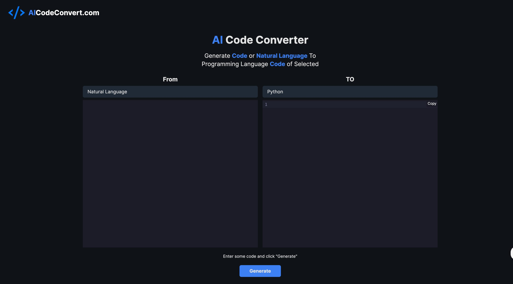
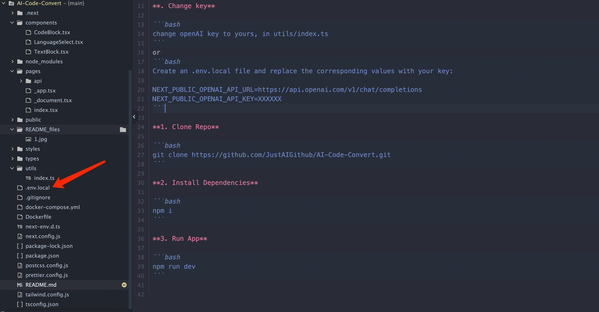

# AI Code Translator

Use AI to translate code from one language to another.

Clone of [ai-code-tranlator](https://github.com/mckaywrigley/ai-code-translator.git)



## Running Locally

**. Change key**

```bash
change openAI key to yours, in utils/index.ts
```
or
```bash
Create an .env.local file and replace the corresponding values with your key:

NEXT_PUBLIC_OPENAI_API_KEY=XXXXXX

```


**1. Clone Repo**

```bash
git clone https://github.com/JustAIGithub/AI-Code-Convert.git
```

**2. Install Dependencies**

```bash
npm i
```

**3. Run App**

```bash
npm run dev
```

